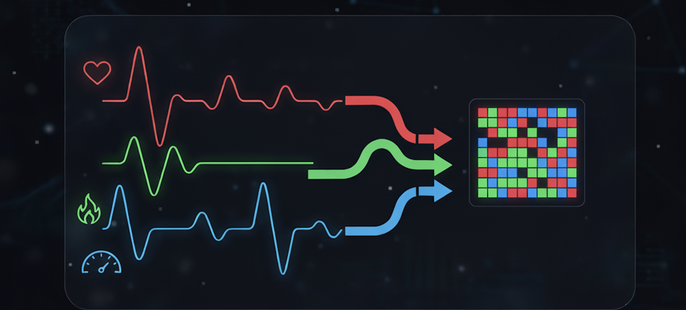
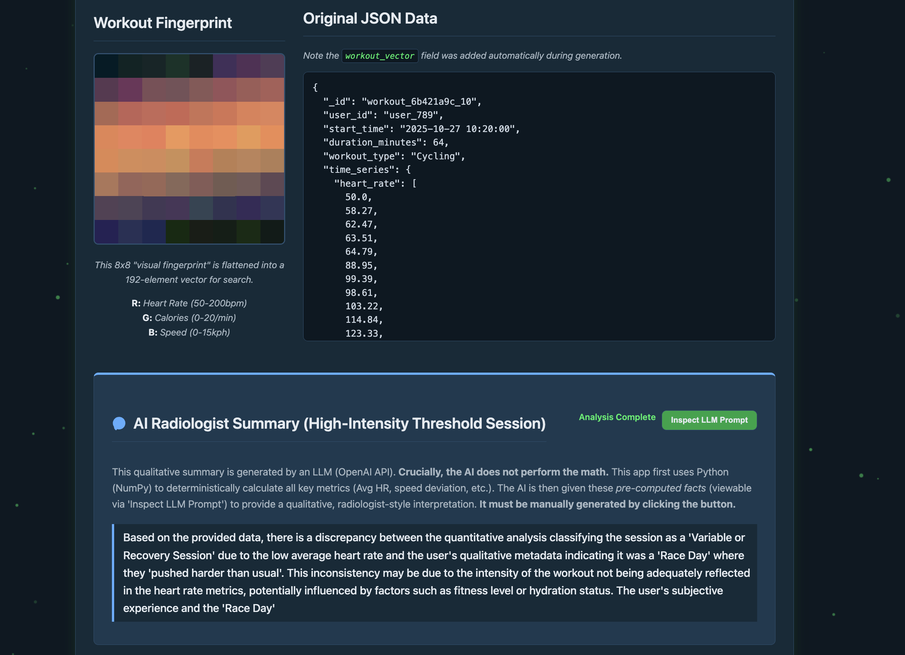

# **The Workout Radiologist**  



# **The Workout Radiologist: Teaching Databases to "See" Your Effort**

Imagine logging hundreds, maybe thousands, of workouts. Each one, a digital chronicle of sweat, effort, and maybe even a personal best. Now, picture this: you want to find that *one specific* interval session from last summer. Not just *any* interval session, but the one where you absolutely *nailed* the pacing, the one that *felt* just right. How do you search for that *feeling*?

Filtering by date? Title? Duration? That's child's play. But searching for the *shape* of the effort, the *rhythm* of your performance? That's where traditional databases often hit a wall, bogged down by simple metadata.

Enter the **FastAPI Workout Radiologist**. This project isn't just another fitness tracker; it's a high-performance system built on a modern async Python stack, designed to fundamentally change how we interact with time-series data. We move beyond basic stats and teach the database—**MongoDB Atlas**, specifically—to *see* each workout as a unique **visual signature**. The goal? To find your *workout twin*—the session that truly mirrors the structure and intensity of another, using the power of **Atlas Vector Search**.

-----

## 🤯 The Search Problem: Why Finding Your "Workout Feeling" is Hard

Searching time-series data for *similarity in pattern* is notoriously difficult. Let's say you have two 64-minute heart rate logs. How do you computationally determine if they "feel" similar?

The classic approach involves algorithms like **Dynamic Time Warping (DTW)**. DTW is clever; it can find similarities even if events happen at slightly different times (like starting your sprint a few seconds later). But it comes with major drawbacks:

1.  **Computational Cost:** DTW often runs in $O(n^2)$ time. Comparing one 64-point series to another isn't too bad, but comparing one against a million others? That requires a million $O(n^2)$ operations. Grab a coffee; it'll be a while.
2.  **Indexing Nightmare:** You *cannot* create a traditional database index to speed up DTW searches. There's no shortcut. Every single search requires comparing your target workout against *every other workout* in the database.

This makes finding workouts based on their *intrinsic pattern* practically impossible for real-time applications with large datasets. We needed a different approach.

-----

## 💡 The Core Innovation: Turning Time into Texture



Our breakthrough hinges on a simple, powerful idea: **Treat complex 1D time-series data like a simple 2D image.**

If we can represent the *pattern* of a workout visually, we can potentially leverage techniques used in image analysis and, crucially, vector databases. Instead of complex, unindexable DTW comparisons, we aim for fast, indexable vector similarity searches. We're teaching the database to recognize the *texture* of your effort.

-----

## **Part 1: The Vision—The Encoding Pipeline**

Here’s how we transform raw workout data into a searchable "visual fingerprint":

**(See Appendix E for a detailed visual breakdown)**

1.  **Channel Assignment:** We map our core metrics to color channels, just like in a digital image:

      * **Heart Rate** → **Red** (Intensity of effort)
      * **Calories Burned per Minute** → **Green** (Metabolic output)
      * **Speed (kph)** → **Blue** (Pacing and movement)

2.  **Normalization & Folding (The Magic Step):**

      * Each metric's 64 data points (for a 64-minute workout) are first normalized to a consistent range (0-255). This ensures fair comparison regardless of absolute values.
      * Then, we *fold* each 64-point linear sequence into an **8x8 grid**. Imagine taking a long string of 64 numbers and wrapping it every 8 numbers, like forming a paragraph from a single line of text. Minute 0-7 becomes row 1, minute 8-15 becomes row 2, and so on. This converts temporal sequences into spatial patterns.

3.  **The RGB Fingerprint:**

      * The three 8x8 grayscale grids (one for HR, one for Calories, one for Speed) are stacked together, pixel by pixel.
      * This creates a single **8x8x3 RGB image**—a compact, visual summary of the entire workout's structure. High-intensity intervals might appear as bright horizontal stripes; a steady endurance run might look like a smooth, consistent color field.

4.  **Vectorization:**

      * Finally, we **flatten** this 8x8x3 image (8 rows \* 8 columns \* 3 channels = 192 values) into a single **192-element numeric vector**.
      * This vector, `workout_vector`, is what we store in MongoDB Atlas. It's the numerical representation of the visual fingerprint, ready for indexing and searching.

-----

### **Why an 8x8 Image? Dimensionality and Texture**

Why not a 64x1 image, or something else? The 8x8 shape is a deliberate choice:

  * **Capturing Texture:** Folding the data creates 2D proximity between points that were originally separated in time (e.g., minute 0 is now adjacent to minute 8 in the grid). This can help algorithms (or even the human eye) pick up on periodic patterns like intervals that manifest as textures or stripes in the image.
  * **Manageable Dimensionality:** 192 dimensions is relatively small for modern vector databases, allowing for efficient indexing and fast searches. A larger image (like 32x32) would create a much higher-dimensional vector, potentially increasing index size and search latency.
  * **Lossy But Effective Compression:** We are performing a kind of "dimensionality reduction" or feature extraction. We lose some fine-grained temporal precision (we don't know *exactly* which second a sprint started from the image alone), but we preserve the overall *shape*, *intensity*, and *structure* of the workout.

It's akin to a medical X-ray: you lose the surface details, but the underlying structure becomes clearly visible. This vector captures the *essence* of the workout's pattern.

-----

## **Part 2: The Engine Room—Asynchronous & Resilient**

To make this system fast, responsive, and robust, we built it using **FastAPI** (a modern Python web framework) and **Motor** (the asynchronous MongoDB driver).

### **Why Async Matters, Especially with Indexing**

Creating or updating a vector index in Atlas isn't instant—it can take minutes, especially with large datasets or complex definitions. A traditional, synchronous web application would simply freeze during this time, unable to serve *any* requests. That's unacceptable.

Our asynchronous approach solves this:

1.  **Non-Blocking Operations:** Using `async` and `await` with FastAPI and Motor means the application doesn't wait idly. When it needs to talk to the database (e.g., to check index status), it yields control, allowing the server (Uvicorn) to handle other incoming requests.
2.  **Smart Index Management (`AsyncAtlasIndexManager`):** We built a custom helper class that handles Atlas Search index creation, updates, and status checks asynchronously.
      * **Polling without Blocking:** It periodically checks if the index is ready using `asyncio.sleep()`. During this sleep, the application is free to do other work.
      * **Startup Guarantees:** The `@app.on_event("startup")` handler uses this manager to ensure the necessary vector index exists and is queryable *before* the application starts accepting traffic, preventing errors on the first few requests.
3.  **Graceful Degradation:** If the vector index build fails or times out during startup (e.g., due to network issues or Atlas tier limitations), the application logs the error but *continues running*. The main gallery page will still load; only the vector search features ("Workout Twins") become unavailable until the index is manually fixed or the app restarts successfully.

### **Architectural Patterns: Proxies and Retries**

  * **Proxy Pattern (`DbProxy`, `CollectionProxy`):** We wrap the standard Motor database and collection objects. This provides a clean way to attach our custom `AsyncAtlasIndexManager` (`db.workouts.index_manager`) and keeps the database interaction code in our routes looking simple (`await db.workouts.find_one(...)`). It also opens the door for adding centralized caching, logging, or custom error handling later.
  * **Retry Logic:** Database operations, especially index management, can face transient issues (network blips, Atlas cluster scaling). Our startup sequence includes a robust retry loop (attempting up to 5 times with delays) when ensuring the vector index is ready. This makes the application resilient to temporary hiccups during initialization.

This asynchronous foundation ensures the Workout Radiologist is responsive and robust, even when dealing with potentially long-running background tasks like vector index builds.

-----

## **Part 3: The Discovery—Finding Your Workout Twin with `$vectorSearch`**

With our workouts encoded as 192-dimension vectors and indexed in Atlas, the magic happens. When a user views a specific workout, say *Workout \#42* (a tough hill repeat session), we grab its `workout_vector` and use MongoDB's `$vectorSearch` aggregation stage to find similar workouts:

```python
pipeline = [
    {
      "$vectorSearch": {
        "index": "workout_vector_index",  # The name we defined for our index
        "path": "workout_vector",         # The field containing the 192-element array
        "queryVector": current_vector,    # The vector of the workout we're viewing
        "numCandidates": 100,             # Check the 100 closest candidates initially
        "limit": 3,                       # Return the top 3 matches
        "filter": { "_id": { "$ne": doc_id } } # Exclude the workout itself
      }
    },
    { 
      # Include the similarity score in the results
      "$project": { 
          "_id": 1, 
          "score": {"$meta": "vectorSearchScore"} 
      } 
    }
]
```

Atlas Vector Search rapidly scans the index and returns the IDs of the workouts whose vectors are closest to the query vector, along with a similarity score. Maybe *Workout \#88* from last month pops up with a score of 0.98 – a near-perfect structural match\! The user can click through and compare, perhaps rediscovering a session they'd forgotten but whose *pattern* was highly effective.

### **The Power of Cosine Similarity**

We configured our index to use **cosine similarity**. This metric measures the cosine of the angle between two vectors:

$\text{similarity} = \cos(\theta) = \frac{\vec{A} \cdot \vec{B}}{\lVert \vec{A} \rVert\,\lVert \vec{B} \rVert}$

Why cosine? Because it focuses on the *orientation* (the pattern) of the vectors, not just their magnitude.

  * **Magnitude Invariance:** A professional athlete and a beginner might perform workouts with the exact same *structure* (e.g., 5 intervals with specific rest periods), but their absolute HR, speed, and calorie values will differ significantly. Cosine similarity correctly identifies these as highly similar because the *shape* of their effort, represented by the vector's direction, is nearly identical.
  * **Pattern Matching:** It excels at finding vectors that point in the same direction in the 192-dimensional space, meaning the relative ups and downs across the workout's visual fingerprint are alike.

This turns MongoDB Atlas from a simple data repository into an intelligent engine capable of understanding the *shape* and *rhythm* of your workouts – the true "Workout Radiologist."

-----

## **Part 4: The Intelligence Layer—Smart AI Integration**

The app includes an "AI Radiologist Summary" feature, using OpenAI's API to generate a concise, expert-like analysis of the workout. However, we're careful about *what* we ask the AI to do.

### **The Problem: LLMs Aren't Calculators**

Large Language Models (LLMs) like GPT-3.5 or GPT-4 are phenomenal at understanding and generating human-like text. They can look at structured data and provide insightful interpretations. However, they are *not* inherently designed for precise, multi-step mathematical calculations on raw data arrays. Asking an LLM to calculate the average heart rate, standard deviation of speed, and total calories from the 64-point arrays directly is risky:

  * **Potential for Hallucination:** The LLM might make a plausible-sounding but incorrect calculation.
  * **Increased Cost & Latency:** Processing raw arrays requires more input tokens and potentially more complex reasoning, increasing API costs and response times.
  * **Lack of Determinism:** The same input might not *always* yield the exact same numerical result from the LLM.

### **The Solution: Deterministic Math First, AI Interpretation Second**

We adopt a more robust and reliable approach:

1.  **Calculate Metrics Reliably (Python/NumPy):** We use NumPy within our FastAPI application to calculate key quantitative metrics (average HR, max HR, speed standard deviation, total calories, etc.) from the raw time-series data. This is fast, accurate, and 100% deterministic.
2.  **Gather Context (Atlas Vector Search):** We perform the `$vectorSearch` to find the top 3 "Workout Twins."
3.  **Assemble a Structured Prompt:** We create a detailed prompt for the LLM that includes:
      * The workout ID.
      * The pre-calculated quantitative metrics.
      * A qualitative description of the visual pattern (derived from the metrics).
      * The IDs and similarity scores of the "Workout Twins."
4.  **Request Qualitative Summary (OpenAI API):** We then send this structured prompt to the OpenAI API, asking the LLM to act as a "Workout Radiologist" and provide a concise, *qualitative* summary focusing on the pattern and function of the effort, based on the *facts* provided.

### **Transparency is Key**

The application includes an "Inspect LLM Prompt" button. This allows the user to see the *exact* structured information sent to the AI. This builds trust by showing that the AI's summary is grounded in real, pre-calculated data, not just opaque AI magic. We leverage the LLM for what it does best – language and interpretation – while keeping the critical math deterministic and verifiable.

-----

-----

## **Appendices**

### **Appendix A: The Full Technology Stack**

| Layer                        | Technology                   | Purpose                                                              |
|-----------------------------|------------------------------|----------------------------------------------------------------------|
| **Web Framework** | FastAPI + Uvicorn            | Modern, async-compatible HTTP server for low-latency APIs.           |
| **Database Driver** | Motor                        | Asynchronous, non-blocking MongoDB driver.                           |
| **Vector Search** | MongoDB Atlas Vector Search  | Native indexing with cosine similarity for k-NN queries.             |
| **LLM Integration** | OpenAI API (via `httpx`)     | Summaries and classification text from a GPT-style model.            |
| **Data Processing** | NumPy                        | Fast numerical operations (min/max/mean/std dev, reshape).           |
| **Image Generation** | Pillow (PIL)                 | Creating 8×8×3 RGB images from arrays, base64 PNG encoding.          |
| **Visualization** | Matplotlib + Agg backend     | Generating line charts for the encoding pipeline visualization.      |
| **Environment** | `python-dotenv`              | Secure credential management (`MONGO_URI`, `OPENAI_API_KEY`).        |

**Critical Dependencies:**

```text
motor ~= 3.4          # Or latest compatible version
fastapi ~= 0.110        # Or latest compatible version
uvicorn[standard] ~= 0.29
httpx ~= 0.27
numpy ~= 1.26         # Or latest compatible version
Pillow ~= 10.0
matplotlib ~= 3.8
python-dotenv ~= 1.0
```

-----

### **Appendix B: Atlas Vector Search Index Definition**

The core of the similarity search functionality relies on this Atlas Search index definition applied to the `workouts` collection:

```json
{
  "name": "workout_vector_index", // Or your chosen index name
  "database": "workout_db",       // Your database name
  "collectionName": "workouts",
  "definition": {
    "mappings": {
      "dynamic": false, // Only index specified fields
      "fields": {
        "workout_vector": {
          "type": "knnVector",
          "dimensions": 192,
          "similarity": "cosine"
        },
        "_id": { // Optional, but useful for filtering
          "type": "token" 
        }
        // You could add other filterable fields here (e.g., workout_type)
      }
    }
  }
}
```

  * `"type": "knnVector"`: Specifies a field optimized for vector similarity search.
  * `"dimensions": 192`: Must match the length of the `workout_vector` array (8x8x3).
  * `"similarity": "cosine"`: Chosen for its effectiveness in matching patterns regardless of magnitude.
  * `_id` mapping: Allows efficient filtering (e.g., excluding the query document itself from results).

-----

### **Appendix C: The Normalization Function**

This Python function ensures all time-series data is scaled consistently between 0 and 255 before being folded into the 8x8 grids.

```python
import numpy as np

# Defined bounds help standardize the visual output
NORM_BOUNDS = {
    "heart_rate": (50, 200),      # Typical HR range during exercise
    "calories_per_min": (0, 20), # Reasonable max calorie burn rate
    "speed_kph": (0, 25)         # Covers walking up to fast sprints
}

def normalize_data(data: np.ndarray, min_val: float, max_val: float) -> np.ndarray:
    """Clips data to bounds and scales it to 0-255."""
    clipped_data = np.clip(data, min_val, max_val)
    range_val = max_val - min_val
    if range_val == 0:
        # Avoid division by zero if min and max are the same
        return np.zeros_like(clipped_data, dtype=np.uint8) 
    
    # Scale to 0-1 range
    normalized_zero_to_one = (clipped_data - min_val) / range_val
    
    # Scale to 0-255 and cast to unsigned 8-bit integer
    return (normalized_zero_to_one * 255).astype(np.uint8)

# Example Usage:
# hr_data = np.array([... 64 heart rate values ...])
# hr_normalized = normalize_data(hr_data, *NORM_BOUNDS["heart_rate"])
```

  * **Clipping:** Prevents extreme outliers (e.g., erroneous HR reading of 250) from skewing the entire 0-255 range.
  * **Scaling:** Maps the clipped data linearly from `[min_val, max_val]` to `[0, 255]`.
  * **`uint8` Casting:** Converts the data into the standard data type for image pixel intensity values.

-----

### **Appendix D: Asynchronous Startup Logic**

The `@app.on_event("startup")` function in `main.py` orchestrates the critical setup steps using the `AsyncAtlasIndexManager`:

```python
@app.on_event("startup")
async def startup_event():
    logger.info("FastAPI app starting up...")
    # ... (Initialize collection, index_manager) ...
    
    MAX_STARTUP_RETRIES = 5
    RETRY_DELAY_SECONDS = 10

    try:
        # 1. Check if database needs seeding
        count = await collection.count_documents({}, limit=1)
        needs_seeding = (count == 0)
        
        # 2. Ensure Vector Index exists and is ready (with retries)
        index_ready = False
        for attempt in range(MAX_STARTUP_RETRIES):
            try:
                logger.info(f"Ensuring Atlas Vector Search index '{VECTOR_INDEX_NAME}'...")
                index_ready = await index_manager.create_search_index(
                    name=VECTOR_INDEX_NAME,
                    definition=VECTOR_INDEX_DEF, # From Appendix B
                    index_type="vectorSearch",   # Use "vectorSearch" type
                    wait_for_ready=True,         # Poll until queryable or timeout
                    timeout=600                  # Wait up to 10 minutes
                )
                if index_ready:
                    logger.info("Vector index is ready.")
                    break # Success! Exit retry loop.
                # ... (Handle case where create_search_index returns False without exception)
            except (OperationFailure, TimeoutError, AutoReconnect) as e:
                logger.warning(f"Attempt {attempt + 1} failed: {e}")
                if attempt < MAX_STARTUP_RETRIES - 1:
                    await asyncio.sleep(RETRY_DELAY_SECONDS)
                else:
                    logger.critical("Failed to ensure vector index after multiple retries.")
                    # Application might proceed in degraded mode or raise an error
            # ... (Handle unexpected exceptions)

        # 3. Ensure standard indexes (like _id) exist
        await index_manager.create_index("_id") 

        # 4. Seed database if it was empty
        if needs_seeding:
            await seed_database(collection, num_to_seed=20)
            
    except Exception as e:
        logger.critical(f"CRITICAL STARTUP ERROR: {e}", exc_info=True)
        # Optionally re-raise to prevent app start on critical failure

    logger.info(f"Startup complete. Vector Index Ready: {index_ready}.")
```

This sequence ensures the application starts robustly, handles common Atlas behaviors like index builds and cold starts, and seeds data only when necessary.

-----

### **Appendix E: Visualizing the Encoding Pipeline**

This is how we get from raw numbers to a searchable visual fingerprint:

**Step 1: Start with 1D Time-Series Data (64 mins)**

  * We have three arrays, each with 64 numbers (normalized 0-255).
      * `[HR_0, HR_1, ..., HR_63]`
      * `[CAL_0, CAL_1, ..., CAL_63]`
      * `[SPD_0, SPD_1, ..., SPD_63]`

**Step 2: "Fold" each 1D array into a 2D (8x8) Grid**

  * Take the first 8 numbers for the first row, the next 8 for the second, etc.
    ```
    1D Array: [ 0, 1, 2, 3, 4, 5, 6, 7,  8, 9, ..., 63 ]
                 |_________________|  |____________
                        |                 |
                        V                 V
    2D Grid:  [[ 0, 1, 2, 3, 4, 5, 6, 7 ],  <- Row 1 (Minutes 0-7)
               [ 8, 9,10,11,12,13,14,15 ],  <- Row 2 (Minutes 8-15)
               ...
               [56,57,58,59,60,61,62,63 ]]  <- Row 8 (Minutes 56-63)
    ```
  * This creates three separate 8x8 grayscale "channels": `HR_8x8`, `CAL_8x8`, `SPD_8x8`.

**Step 3: Stack the 8x8 Channels into an 8x8x3 RGB Image**

  * Imagine layering the three 8x8 grids. For each pixel location `(row, col)`:
      * The Red value comes from `HR_8x8[row, col]`.
      * The Green value comes from `CAL_8x8[row, col]`.
      * The Blue value comes from `SPD_8x8[row, col]`.
  * This results in a single 8x8 color image where each pixel holds R, G, and B information.

**Step 4: Flatten the 8x8x3 Image into a 192-Element Vector**

  * Read the pixel values row by row, taking the R, G, B values for each pixel in sequence.
    ```
    Vector = [ P(0,0)R, P(0,0)G, P(0,0)B,  # Pixel at row 0, col 0
               P(0,1)R, P(0,1)G, P(0,1)B,  # Pixel at row 0, col 1
               ...
               P(0,7)R, P(0,7)G, P(0,7)B,  # Last pixel of row 0
               P(1,0)R, P(1,0)G, P(1,0)B,  # First pixel of row 1
               ...
               P(7,7)R, P(7,7)G, P(7,7)B ] # Last pixel of last row
    ```
  * This final list of 192 numbers is the `workout_vector` stored in MongoDB.

-----

## **Future Refinements**

This "visual fingerprint" approach is just the beginning. Potential enhancements include:

1.  **Learned Embeddings (Convolutional Autoencoders):** Train a neural network (CAE) to automatically learn an even more compact and meaningful vector representation (e.g., 32 or 64 dimensions) directly from the time-series or the 8x8 image, potentially capturing more nuanced patterns.
2.  **User-Weighted Search:** Allow users to specify which metric (HR, Speed, Calories) is most important for a given search, perhaps by adjusting the normalization ranges or weighting the channels before vector creation or during the search query.
3.  **Multi-Resolution Encoding:** Create multiple fingerprints at different time granularities (e.g., one for the whole workout, separate ones for the first/second half) to capture both overall structure and specific phase details.
4.  **Cluster Visualization (t-SNE/UMAP):** Project the 192-dimensional vectors down to 2D to visually explore clusters of similar workouts, revealing natural groupings in a user's training history.
5.  **Workout Recommendations:** Instead of just finding past twins, use vector similarity to suggest *future* workout patterns based on goals or desired training adaptations.
6.  **Real-World Data Integration:** Connect to APIs from Garmin, Strava, Apple Health, etc., to ingest actual user workout data, replacing the synthetic generator.

-----

## **Conclusion: Giving Data Structure, Giving Databases Sight**

The **FastAPI Workout Radiologist** demonstrates a powerful paradigm shift: transforming sequential, temporal data into a spatial, visual representation to unlock new search capabilities. By encoding workout patterns as image-based vectors, we bypass the limitations of traditional time-series comparison and leverage the speed and scalability of **MongoDB Atlas Vector Search**.

This project elegantly combines:

  * **Asynchronous Resilience:** Ensuring a smooth user experience even with background database tasks.
  * **Creative Feature Engineering:** The 1D-to-2D "folding" technique to create meaningful visual fingerprints.
  * **Vector-Based Pattern Discovery:** Using Atlas Vector Search and cosine similarity to find structurally similar workouts instantly.
  * **Responsible AI Integration:** Using LLMs for qualitative interpretation grounded in deterministically calculated metrics.

It's a testament to modern data engineering, showcasing how blending numerical methods, clever data representation, scalable database features, and generative AI can create truly novel user experiences. The ability to search for the *feeling* or *pattern* isn't limited to workouts—imagine applying this to financial market data, IoT sensor readings, medical signals, or any domain where the *shape* of data over time holds meaning.

We've taught our database to "see" the rhythm in the numbers. Go explore, find your workout twins, and imagine where else this approach could take you\!